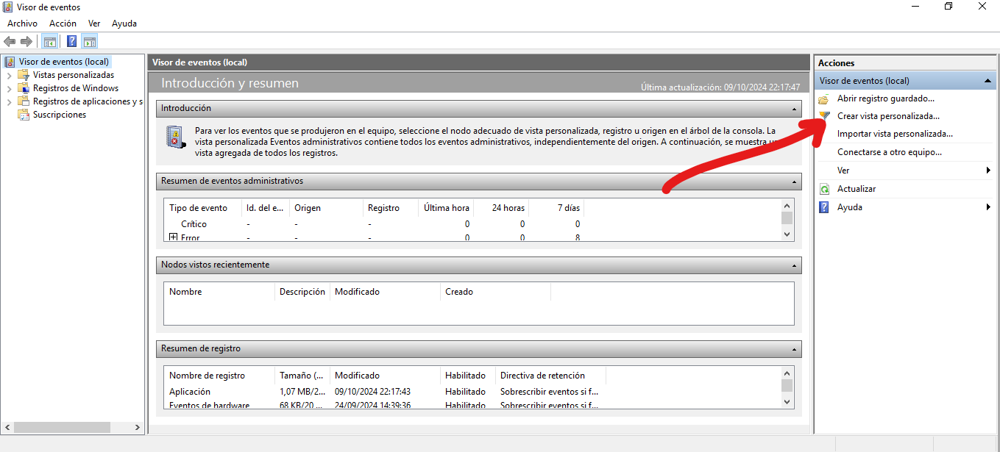
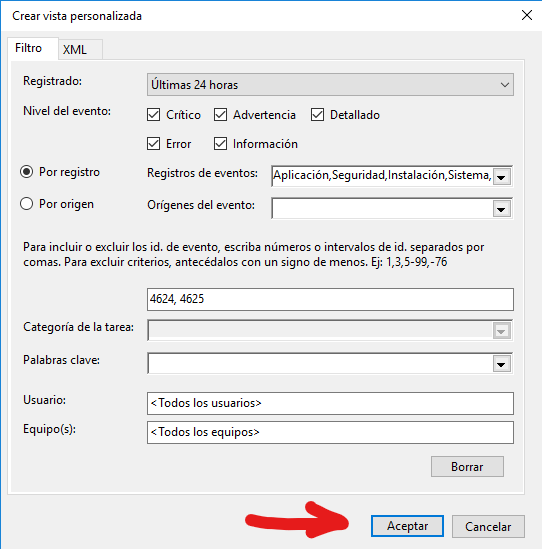

1 - Crear una vista personalitzada.

1.1 - Fem clic a Crear vista personalizada.

1.2 - Fiquem els parametres que volguem en el meu cas com es veu en pantalla:
- Ultimes 24h
- Por registro > Registros de Windows
- He ficat el id de Login correcte i Login incorrecte
I fem clic a Aceptar
