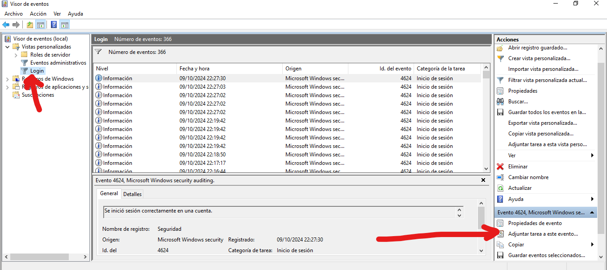
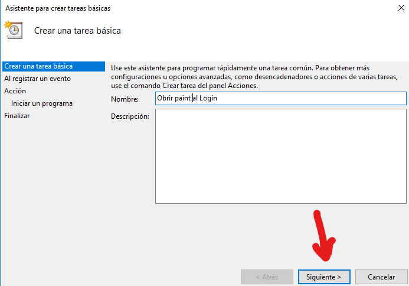
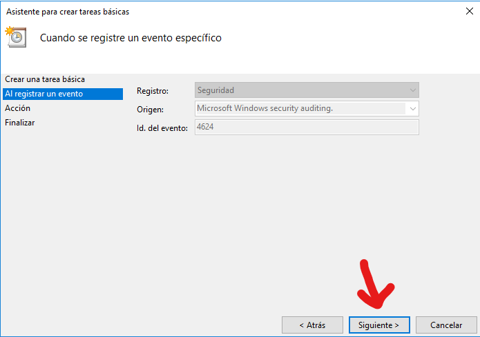
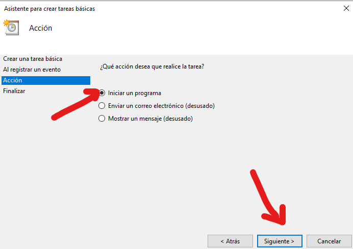
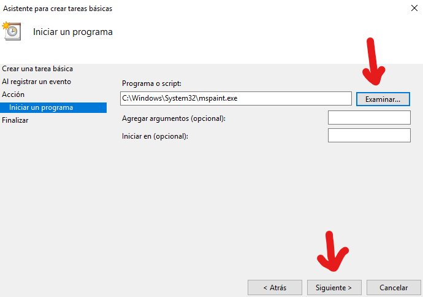
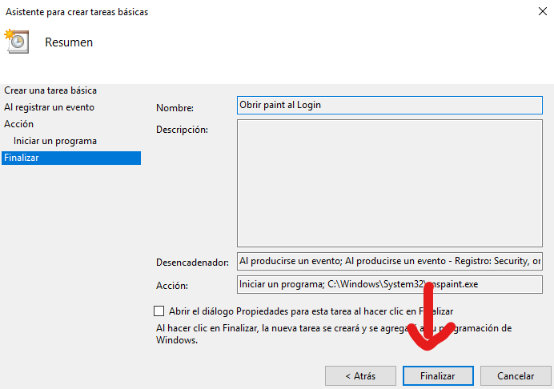

# 2 - Programar una tasca quan es crea un esdeveniment
Quan un usuari iniciï sessió l'esdeveniment executarà un programa de Windows.

2.1 - Fem clic a Login i a Adjuntar tarea a este evento.

2.2 - Fiquem el nom i li donem a Siguiente.

2.2 - Li donem a Siguiente.

2.2 - Seleccionem Iniciar un programa i li donem a Siguiente.

2.3 - Seleccionem un programa i li donem a Siguiente.

2.3 - Li donem a Finalizar.
