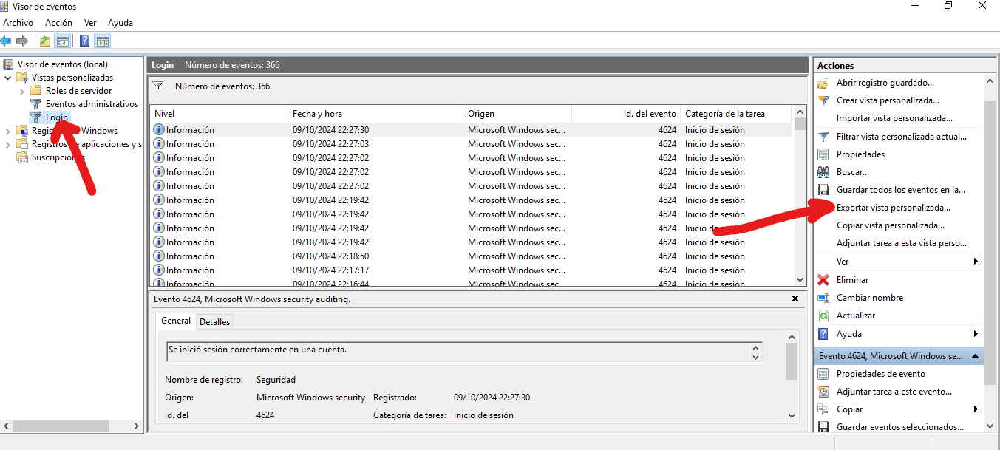
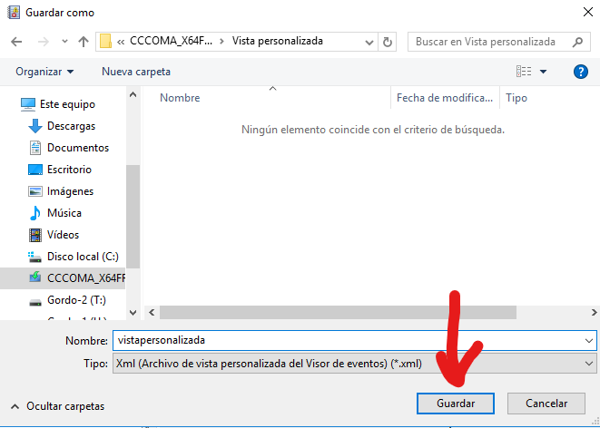

# 3 - Exporta una vista personalitzada a un fitxer XML.

3.1 - Seleccionem la vista i li donem a Exportar vista personalizada.

3.1 - Seleccionem on el volem guardar, li fiquem un nom i li donem a Guardar.
