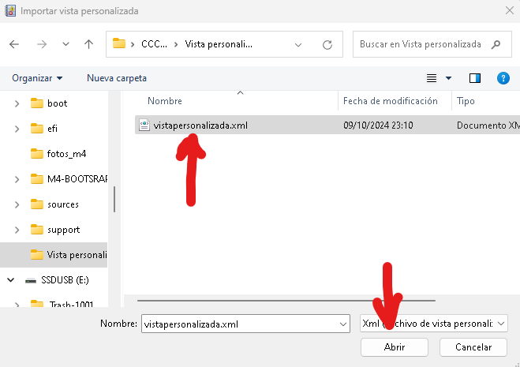

# 4 - Des d'una altra MV importa la vista personalitzada.

4.1 - Ens passem el fitxer al PC que volem ficar la vista personalitzada.

4.2 - Seleccionem Importar vista personalizada.

4.3 - Seleccionem el fitxer al PC que volem ficar la vista personalitzada.
